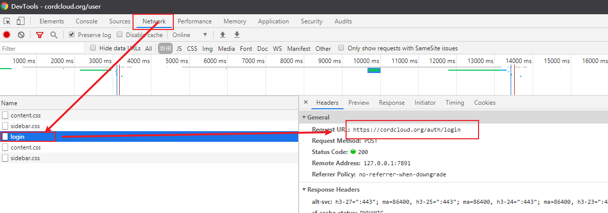

# CordCloud签到脚本
CordCloud签到脚本一键运行签到，每次签到50到400MB的流量，一年就是17.82G到142.57G的流量，  
也不少呢，总是忘记签到，所以写一个脚本可以一键签到，把这个脚本配置到开机启动或者定时任务就不用自己操作了。

## 安装
- 下载脚本  
`git clone https://github.com/DeaglePC/CordCloud-Check-in.git && cd CordCloud-Check-in`
- 安装依赖  
`pip install -r requirements.txt`

## 写配置文件
- 拿到用于发送请求的登录密码，这里不能用密码直接登录，要用CordCloud转换后的一个密码  
浏览器打开登录页面，F12打开开发者工具，点击登录，找到自己的email以及passwd参数



- 把拿到的登录参数填到`config.py`  
比如我的email是`tom@qq.com`
passwd是`xxooxxoo`
```python
LOGIN_FORM = {
    "email": os.getenv("CC_EMAIL", "tom@qq.com"),
    "passwd": os.getenv("CC_PASSWD", "xxooxxoo"),
    "code": "",
}
```
**为了安全你可以不把参数写进配置文件，也可以支持配置到环境变量**

- 配置`config.py`中的`PROXIES`参数  
由于访问CordCloud是需要代理的，所以这里需要配置一下代理，这个就不用多少了吧。我这里是clash的地址。
```python
PROXIES = {
    "http": "http://192.168.41.218:7890",
    "https": "http://192.168.41.218:7890",
}
```

- 日志文件默认写到当前目录，你也可以自己配置一个目录，签到记录都在这里，如果有报错也会在这里
```python
LOG_FILE = "./cc_auto_check_in.log"
```

- 配置server酱提示（可选）  
支持server酱提示，如果脚本报错了也是会发送server酱提示的，这样可以及时知道脚本运行是否正常,
`ENABLE_SERVER_JIANG = False`可以关闭server酱提示，默认关闭  
[关于server酱](http://sc.ftqq.com/3.version)
```python
ENABLE_SERVER_JIANG = True
SERVER_JIANG_KEY = os.getenv("SERVER_JIANG_KEY", "xxxxxxx")
```


### 运行
这里的python版本是3.7
#### Windows
```cmd
./cc_auto_check_in.bat
```
#### Linux/Unix
```bash
./cc_auto_check_in.sh
```

### 配置开机启动或者定时启动
这个就不用说了吧，如果不会可以去搜一下
