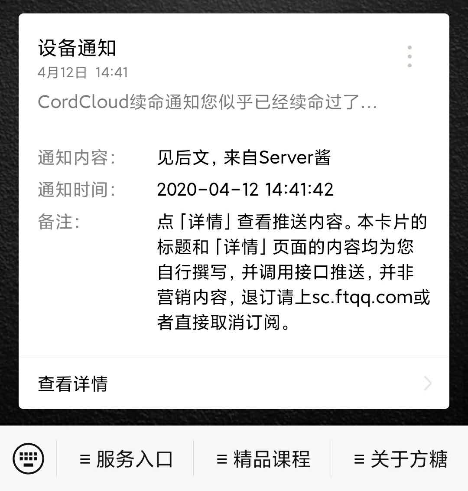
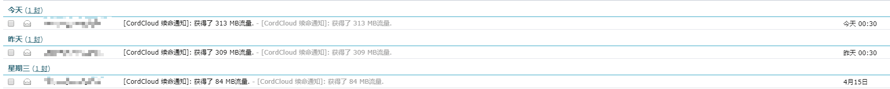

# CordCloud签到脚本
**觉得有用记得点个Star**  

CordCloud签到脚本一键运行签到，每次签到50到400MB的流量，一年就是17.82G到142.57G的流量，  
也不少呢，总是忘记签到，所以写一个脚本可以一键签到，把这个脚本配置到开机启动或者定时任务就不用自己操作了。

## 安装
### Windows
- [直接点我下载](https://github.com/DeaglePC/CordCloud-Check-in/releases/download/1.0/cc_auto_check_in-win-64.zip)
- 解压出来
### Linux
- 下载脚本  
`git clone https://github.com/DeaglePC/CordCloud-Check-in.git && cd CordCloud-Check-in`
- 安装依赖  
`pip install -r requirements.txt`


## 写配置文件
### Windows
- 参照`config.json.bak`文件，新建`config.json`
- 填写登录参数（邮箱，密码）
```json
{
    "LOGIN_FORM": {
    "email": "邮箱",
    "passwd": "密码",
    "code": ""
    }
}
```
- 其他配置参数参考下面说明

### Linux
- 把你自己的登录参数（邮箱，密码）填到`config.py`  
比如我的email是`tom@qq.com`
passwd是`xxooxxoo`
```python
LOGIN_FORM = {
    "email": os.getenv("CC_EMAIL", "tom@qq.com"),
    "passwd": os.getenv("CC_PASSWD", "xxooxxoo"),
    "code": "",
}
```
**为了安全你可以不把参数写进配置文件，也可以支持配置到环境变量**

- 配置`config.py`中的`PROXIES`参数  
由于访问CordCloud是需要代理的，所以这里需要配置一下代理，这个就不用多说了吧。我这里是clash的地址。（如果你是国外VPS），把PROXIES留空即可
```python
PROXIES = {
    "http": "http://192.168.41.218:7890",
    "https": "http://192.168.41.218:7890",
}
```

- 日志文件默认写到当前目录，你也可以自己配置一个目录，签到记录都在这里，如果有报错也会在这里
```python
LOG_FILE = "./cc_auto_check_in.log"
```

- 配置server酱提示（可选）  
支持server酱提示，如果脚本报错了也是会发送server酱提示的，这样可以及时知道脚本运行是否正常,
`ENABLE_SERVER_JIANG = False`可以关闭server酱提示，默认关闭  
[关于server酱](http://sc.ftqq.com/3.version)
```python
# server酱配置(非必填)
SERVER_CHAN_CONFIG = {
    "enable": False,  # True打开
    "key": os.getenv("SERVER_CHAN_KEY", "")
}
```



## 运行
这里的python版本是3.7
### Windows
直接双击运行`cc_auto_check_in.exe`  
没有任何界面弹出是正常的。打开`cc_auto_check_in.log`查看结果
### Linux/Unix
```bash
chmod +x cc_auto_check_in.sh
./cc_auto_check_in.sh
```

## 配置开机启动或者定时启动
这个就不用说了吧，如果不会可以去搜一下  
### windows
配置任务计划即可
### Linux/Unix
配置crontab

## 效果

